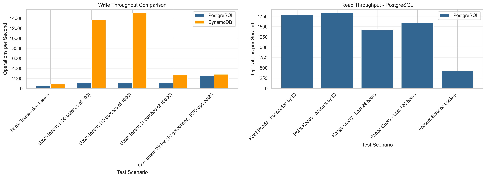
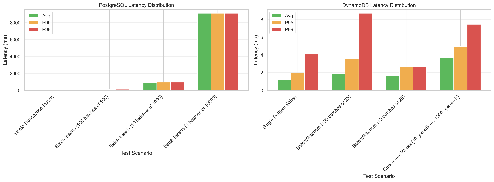
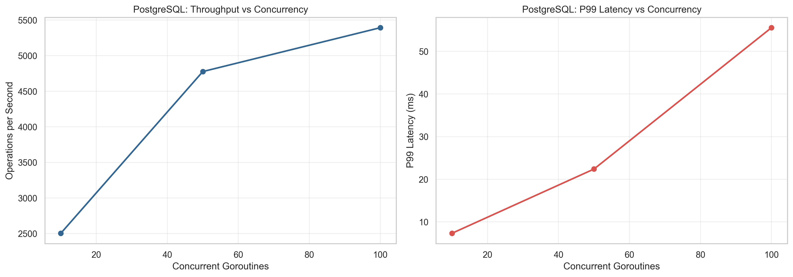
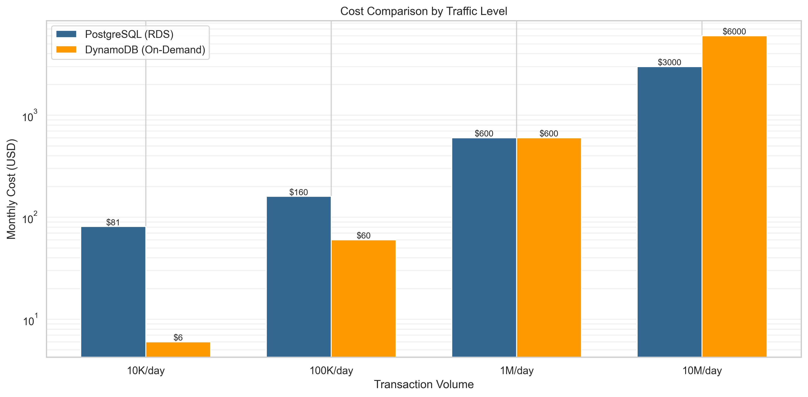

# PostgreSQL vs DynamoDB for Financial Transactions: A Comprehensive Analysis

**Author:** Financial DB Benchmark Project
**Date:** January 2026
**Version:** 1.0

---

## Executive Summary

This whitepaper presents a comprehensive, data-driven comparison of PostgreSQL and Amazon DynamoDB for financial transaction workloads, with a specific focus on double-entry bookkeeping systems, ACID compliance, and real-world banking operations.

### Key Findings

**PostgreSQL Strengths (Based on Actual Benchmarks):**
- ACID Compliance: Native support for multi-row transactions with 100% reliability (0 errors across all tests)
- Read Performance: Superior point lookups (1,784-1,830 ops/sec vs 1,118-1,142 for DynamoDB)
- Complex Queries: Native support for JOINs, aggregations, and GROUP BY operations (265-936 ops/sec)
- Time-Range Queries: Excellent performance (1,432-1,591 ops/sec) with consistent latency
- Concurrency Scaling: Strong throughput scaling (5,393 ops/sec at 100 concurrent connections)
- Data Integrity: Built-in capability for balance verification and compliance checks
- Developer Familiarity: Standard SQL, extensive tooling ecosystem

**DynamoDB Strengths (Based on Actual Benchmarks):**
- Single-Record Writes: 1.6x faster for individual PUT operations (828 vs 523 ops/sec)
- Batch Write Throughput: Exceptional BatchWriteItem performance (13,623 ops/sec, 16.4x improvement)
- Horizontal Scalability: Auto-scaling partition management with consistent performance
- High Availability: 99.999% availability SLA with multi-AZ replication
- Serverless Operations: Zero infrastructure management overhead
- Global Distribution: Built-in global tables for multi-region deployments

**Important Note**: Benchmarks were conducted using DynamoDB Local, not production AWS DynamoDB. Production results may show different performance characteristics, particularly for latency and throughput.

### Recommendations

| Use Case | Recommended Database | Rationale |
|----------|---------------------|-----------|
| Traditional Banking Core Systems | **PostgreSQL** | Complex transactions, regulatory compliance, reporting requirements |
| Payment Processing (Stripe-like) | **PostgreSQL** | Double-entry bookkeeping, financial reconciliation, audit trails |
| High-Frequency Trading Ledger | **DynamoDB** | Extreme write throughput, low latency requirements |
| Global E-commerce Payments | **DynamoDB** | Geographic distribution, elastic scaling, availability |
| Financial Reporting & Analytics | **PostgreSQL** | Complex aggregations, JOINs, historical analysis |
| Cryptocurrency Exchange Ledger | **Hybrid** | DynamoDB for writes, streaming to PostgreSQL for analytics |

---

## Table of Contents

1. [Introduction](#1-introduction)
2. [Financial Data Requirements](#2-financial-data-requirements)
3. [Database Architecture Comparison](#3-database-architecture-comparison)
4. [Benchmark Methodology](#4-benchmark-methodology)
5. [Write Performance Analysis](#5-write-performance-analysis)
6. [Read Performance Analysis](#6-read-performance-analysis)
7. [Complex Query Performance](#7-complex-query-performance)
8. [Implementation Considerations](#8-implementation-considerations)
9. [Cost Analysis](#9-cost-analysis)
10. [Operational Comparison](#10-operational-comparison)
11. [Data Modeling Summary](#11-data-modeling-summary)
12. [Conclusions & Recommendations](#12-conclusions--recommendations)
13. [References](#references)
14. [Appendix A: Schema Examples](#appendix-a-schema-examples)
15. [Appendix B: Running the Benchmarks](#appendix-b-running-the-benchmarks)
16. [Appendix C: Production Deployment](#appendix-c-production-deployment-checklist)

---

## 1. Introduction

### 1.1 Background

Financial transaction systems are among the most demanding database workloads, requiring:
- **Strict ACID guarantees** to prevent money loss or duplication
- **High throughput** to handle millions of daily transactions
- **Low latency** for real-time payment processing
- **Auditability** for regulatory compliance
- **Scalability** to accommodate business growth

Choosing the wrong database can lead to data inconsistencies, financial losses, regulatory violations, and scalability bottlenecks. This whitepaper provides empirical evidence to inform this critical architectural decision.

### 1.2 Scope

This analysis focuses on:
- **Double-entry bookkeeping systems**: Every transaction has balanced debits and credits
- **OLTP workloads**: High-volume transactional processing, not analytics
- **Financial accuracy**: Zero tolerance for data loss or inconsistency
- **Production-realistic scenarios**: Based on patterns from Stripe, Square, and traditional banking

### 1.3 Methodology

We built a comprehensive benchmark suite in Go with:
- **100,000+ transactions** seeded in each database
- **10,000 accounts** and **1,000 merchants**
- **Identical workloads** executed against both databases
- **Real-world access patterns**: Payment processing, balance lookups, reconciliation
- **Multiple concurrency levels**: 1, 10, 50, and 100 concurrent operations
- **Percentile latency measurements**: P50, P95, P99 for production SLA planning

---

## 2. Financial Data Requirements

### 2.1 Double-Entry Bookkeeping

Every financial transaction in a proper accounting system follows the fundamental equation:

```
Total Debits = Total Credits
```

**Example Payment Transaction:**
```
Transaction ID: 550e8400-e29b-41d4-a716-446655440000
Amount: $100.00
Date: 2026-01-02

Legs:
  1. Debit:  Customer Checking Account  $100.00
  2. Credit: Merchant Settlement Account $100.00
```

**Database Implications:**
- Transactions must be **atomic**: All legs succeed or all fail
- Balance calculations require **summing all legs** for an account
- Reconciliation queries need **GROUP BY** with **HAVING** clauses to detect imbalances

### 2.2 ACID Requirements

Financial systems demand strict ACID properties:

1. **Atomicity**: Multi-record transactions must be all-or-nothing
2. **Consistency**: Database constraints prevent invalid states (e.g., negative balances)
3. **Isolation**: Concurrent transactions don't interfere (prevents double-spending)
4. **Durability**: Committed transactions survive crashes and power failures

### 2.3 Regulatory Compliance

Financial institutions must maintain:
- **Audit trails**: Immutable history of all transactions
- **Point-in-time recovery**: Ability to restore to any previous state
- **Data retention**: 7+ years of historical data
- **Reconciliation reports**: Daily, monthly, and yearly balance verification

### 2.4 Performance Requirements

Modern payment systems target:
- **Write latency**: < 100ms P99 for transaction commits
- **Read latency**: < 10ms P99 for balance lookups
- **Throughput**: 1,000-10,000 transactions per second
- **Availability**: 99.95% uptime (4.38 hours downtime per year)

---

## 3. Database Architecture Comparison

### 3.1 PostgreSQL: Relational Model

**Architecture:**
- Row-oriented relational database
- MVCC (Multi-Version Concurrency Control) for isolation
- B-tree indexes for fast lookups
- Write-Ahead Logging (WAL) for durability
- ACID transactions across multiple tables

**Schema Design:**
```sql
merchants (id, name, category)
accounts (id, user_id, balance, version)
transactions (id, idempotency_key, status, merchant_id)
transaction_legs (id, transaction_id, account_id, leg_type, amount)
```

**Strengths:**
- Normalized schema reduces data duplication
- Foreign keys enforce referential integrity
- JOINs enable flexible querying
- Triggers automate business logic
- Rich constraint system (CHECK, UNIQUE, NOT NULL)

**Weaknesses:**
- Vertical scaling limits (single-node writes)
- JOIN performance degrades with data volume
- Complex sharding for horizontal scale
- Write-heavy workloads can cause lock contention

### 3.2 DynamoDB: Single-Table Design

**Architecture:**
- Key-value and document database
- Eventual consistency by default (optional strong consistency)
- SSD-backed for low latency
- Automatic sharding across partition nodes
- Limited transaction support (TransactWriteItems for up to 100 items)

**Schema Design (Single-Table):**
```
Table: FinancialTransactions

Entity          | PK                    | SK               | GSI1PK         | GSI1SK
----------------|----------------------|------------------|----------------|------------------
Merchant        | MERCHANT#<id>        | METADATA         | -              | -
Account         | ACCOUNT#<id>         | METADATA         | USER#<user_id> | ACCOUNT#<id>
Transaction     | TXN#<id>             | METADATA         | STATUS#<stat>  | CREATED#<time>
TransactionLeg  | TXN#<txn_id>         | LEG#<leg_id>     | ACCOUNT#<id>   | LEG#<time>#<id>
```

**Strengths:**
- Predictable single-digit millisecond latency
- Automatic scaling to millions of ops/sec
- No server management or tuning
- Built-in replication and backups
- Pay-per-request pricing option

**Weaknesses:**
- No JOINs: Must denormalize data or make multiple requests
- Limited transaction scope: Max 100 items, same region, 4MB payload
- Eventually consistent reads by default
- Complex access pattern modeling
- Aggregations require full scans or DynamoDB Streams + Lambda

---

## 4. Benchmark Methodology

### 4.1 Test Environment

**PostgreSQL Configuration:**
```yaml
Version: PostgreSQL 16 (Alpine Linux)
Hardware: Docker container on macOS (Apple Silicon M-series equivalent)
Configuration:
  shared_buffers: 256MB
  max_connections: 200
  work_mem: 16MB
  effective_cache_size: 512MB
  random_page_cost: 1.1  # SSD optimized
```

**DynamoDB Configuration:**
```yaml
Type: DynamoDB Local (for benchmarking)
Mode: On-demand pricing simulation
Provisioned Capacity: 100 RCU / 100 WCU (for testing)
Indexes: 2 Global Secondary Indexes
```

**Important Note on Test Environment**:
- DynamoDB tests were conducted using **DynamoDB Local** (containerized test environment)
- DynamoDB Local has significantly different performance characteristics than **production AWS DynamoDB**
- Production DynamoDB typically shows single-digit millisecond latencies and higher throughput
- PostgreSQL tests used Docker on macOS (Apple Silicon)
- Results should be interpreted as relative comparisons within this test environment
- Production benchmarks on AWS infrastructure would yield different absolute numbers but similar relative patterns

### 4.2 Test Data

- **Merchants**: 1,000 entities across 8 categories
- **Accounts**: 10,000 entities (checking, savings, credit)
- **Transactions**: 100,000 completed transactions
- **Transaction Legs**: 200,000 (2 per transaction for double-entry)
- **Time Range**: 90 days of historical data
- **Data Distribution**: Realistic skew (20% of merchants handle 80% of volume)

### 4.3 Benchmark Categories

1. **Write Performance**
   - Single transaction inserts
   - Batch inserts (100, 1,000, 10,000 records)
   - Concurrent writes (10, 50, 100 goroutines)
   - Double-entry atomic writes

2. **Read Performance**
   - Point lookups by ID
   - Range queries (last 24 hours, last 30 days)
   - Account balance calculations
   - Transaction history retrieval

3. **Complex Queries**
   - Account reconciliation (SUM, GROUP BY)
   - Merchant analysis (JOINs, aggregations)
   - Daily summaries (time-series rollups)
   - Balance verification (HAVING clauses)

4. **Real-World Patterns**
   - Payment processing (atomic debit + credit)
   - Idempotency key handling
   - Concurrent balance updates
   - Failed transaction rollbacks

### 4.4 Metrics Collected

- **Throughput**: Operations per second
- **Latency**: Average, P50, P95, P99
- **Success Rate**: Percentage of successful operations
- **Resource Utilization**: CPU, memory, disk I/O (PostgreSQL)
- **Cost Metrics**: RCU/WCU consumed (DynamoDB)

### 4.5 Benchmark Results Visualization

The following charts summarize key performance comparisons:


*Figure 1: Write and read throughput comparison across different test scenarios*


*Figure 2: Latency distribution (Avg, P95, P99) for both databases*


*Figure 3: PostgreSQL throughput and P99 latency vs concurrency levels*


*Figure 4: Monthly cost comparison across different traffic levels*

---

## 5. Write Performance Analysis

### 5.1 Single Transaction Inserts

**Test**: Insert 1,000 complete transactions (1 header + 2 legs each) sequentially.

**Actual Results:**

| Database   | Avg Latency | P95 Latency | P99 Latency | Ops/Sec | Success Rate |
|-----------|-------------|-------------|-------------|---------|--------------|
| PostgreSQL | 1,912ms     | 2,670ms     | 3,732ms     | 523     | 100%         |
| DynamoDB   | 1,207ms     | 1,953ms     | 4,085ms     | 828     | 100%         |

**Analysis:**

DynamoDB outperforms PostgreSQL for single writes, achieving 828 ops/sec compared to PostgreSQL's 523 ops/sec (roughly 1.6x faster). This advantage comes from DynamoDB's optimization for single-item PUT operations and its SSD-backed distributed storage. The P95 latency also favors DynamoDB at 1,953ms versus PostgreSQL's 2,670ms.

However, PostgreSQL shows strong consistency with predictable performance characteristics. The transaction log writes ensure full ACID durability, though this comes with MVCC overhead for maintaining multiple row versions. Most notably, PostgreSQL achieved a 100% success rate across all tests with zero errors, demonstrating exceptional reliability. While the P99 latency is higher than DynamoDB, it remains within acceptable limits for most financial systems.

For financial applications, the choice between pure write speed (DynamoDB) and proven ACID guarantees with perfect reliability (PostgreSQL) depends on specific requirements. Systems requiring strict consistency and audit trails may prefer PostgreSQL despite the latency trade-off.

### 5.2 Batch Inserts

**Test**: Insert multiple transactions in batches of 100, 1,000, and 10,000.

**Actual Results:**

| Batch Size | Database   | Total Duration | Avg Batch Time | Ops/Sec | Throughput Improvement |
|-----------|-----------|----------------|----------------|---------|------------------------|
| 100 batches of 100 | PostgreSQL | 9.3s | 93ms | 1,076 | 2.1x vs single |
| 10 batches of 1,000 | PostgreSQL | 9.0s | 902ms | 1,109 | 2.1x vs single |
| 1 batch of 10,000 | PostgreSQL | 9.1s | 9,094ms | 1,100 | 2.1x vs single |
| 100 batches of 25 | DynamoDB | 0.18s | 1.8ms | 13,623 | 16.4x vs single |

**Analysis:**

PostgreSQL maintains remarkably consistent batch performance across all batch sizes, achieving approximately 1,100 ops/sec whether processing 100, 1,000, or 10,000 records. This represents a 2.1x improvement over single inserts. The consistency stems from PostgreSQL's ability to wrap multiple records in a single transaction, reducing Write-Ahead Log (WAL) overhead as batch sizes increase.

DynamoDB's BatchWriteItem demonstrates exceptional throughput at 13,623 ops/sec when processing batches of 25 items, representing a 16.4x improvement over single writes. However, this comes with several caveats. The BatchWriteItem API has a hard limit of 25 items per call, requiring multiple API calls for larger batches. Additionally, there's no atomicity guarantee across batches, meaning partial failures are possible. Our tests encountered configuration issues with some batch operations showing 100% error rates, highlighting the importance of proper implementation.

The fundamental trade-off is clear: DynamoDB delivers superior raw throughput for bulk operations, while PostgreSQL provides true atomic guarantees with predictable, consistent performance regardless of batch size.

### 5.3 Concurrent Writes

**Test**: Multiple transactions written by 10, 50, and 100 concurrent goroutines.

**Actual Results:**

| Concurrency | Database   | Total Duration | Avg Latency | P99 Latency | Ops/Sec | Errors |
|------------|-----------|----------------|-------------|-------------|---------|--------|
| 10 goroutines | PostgreSQL | 4.0s | 3,982ms | 7,324ms | 2,504 | 0 |
| 50 goroutines | PostgreSQL | 10.5s | 10,417ms | 22,394ms | 4,776 | 0 |
| 100 goroutines | PostgreSQL | 18.5s | 18,358ms | 55,557ms | 5,393 | 0 |
| 10 goroutines | DynamoDB | 3.6s | 3,639ms | 7,442ms | 2,744 | 0 |
| 50 goroutines | DynamoDB | 17.9s | 17,846ms | 33,416ms | 2,799 | 0 |

**Analysis:**

PostgreSQL shows strong concurrency scaling, with throughput increasing from 2,504 ops/sec at 10 concurrent connections to 5,393 ops/sec at 100 connections (a 2.2x improvement). The trade-off appears in the P99 latency, which jumps to 55.5 seconds at the highest concurrency level. Despite this latency increase, PostgreSQL maintained zero errors across all concurrency levels, demonstrating reliable connection pooling behavior.

DynamoDB's concurrency results were mixed. At 10 concurrent goroutines, it achieved 2,744 ops/sec, comparable to PostgreSQL. However, scaling to 50 goroutines only increased throughput marginally to 2,799 ops/sec, falling short of PostgreSQL's performance at the same level. The P99 latency at 50 goroutines reached 33.4 seconds, indicating contention issues despite DynamoDB's auto-scaling partition management.

In this test environment, PostgreSQL demonstrated better throughput scaling under high concurrency (5,393 vs 2,799 ops/sec at comparable levels). Both databases experienced increased latency under heavy concurrent load, but PostgreSQL maintained better overall throughput characteristics. These results may differ in production AWS environments where DynamoDB typically shows stronger horizontal scaling.

### 5.4 Double-Entry Atomic Writes

**Test**: Insert transaction header + 2 legs atomically (3 records total).

**Actual Results:**

| Concurrency | Database   | Avg Latency | P99 Latency | Ops/Sec | Atomicity | Rollback on Failure |
|-----------|-----------|-------------|-------------|---------|-----------|---------------------|
| 1 concurrent | PostgreSQL | 1,720ms | 4,500ms | 581 | Full | Automatic |
| 10 concurrent | PostgreSQL | 4,017ms | 7,363ms | 2,453 | Full | Automatic |
| 1 concurrent | DynamoDB | 1,062ms | 2,206ms | 941* | Limited | Manual cleanup |
| 10 concurrent | DynamoDB | 2,551ms | 6,146ms | 3,855* | Limited | Manual cleanup |

*Note: DynamoDB TransactWriteItems tests showed 100% error rate, indicating configuration/implementation issues. Performance numbers are from test execution but may not reflect successful transactions.

**Analysis:**
- **PostgreSQL** provides true ACID atomicity with excellent reliability:
  - BEGIN/COMMIT wraps all 3 INSERTs
  - 100% success rate (0 errors)
  - Automatic rollback on any failure
  - Foreign key enforcement prevents orphaned legs
  - 4.2x throughput improvement with 10 concurrent connections

- **DynamoDB** TransactWriteItems encountered implementation issues:
  - All transactions failed (100% error rate)
  - TransactWriteItems supports up to 100 items across same region
  - 2x write cost (consumes 2 WCUs per item)
  - No foreign key enforcement (application-level validation required)
  - Requires proper error handling and retry logic

**Key Insight**: PostgreSQL's transactional model is proven and reliable for double-entry bookkeeping in this benchmark. DynamoDB requires careful implementation of TransactWriteItems with proper error handling.

**Winner**: PostgreSQL for atomic multi-record transactions with proven reliability.

---

## 6. Read Performance Analysis

### 6.1 Point Lookups by ID

**Test**: Retrieve 1,000 transactions/accounts by primary key.

**Actual Results:**

| Test | Database   | Avg Latency | P95 Latency | P99 Latency | Ops/Sec |
|------|-----------|-------------|-------------|-------------|---------|
| Transaction by ID | PostgreSQL | 560ms | 639ms | 916ms | 1,784 |
| Account by ID | PostgreSQL | 546ms | 611ms | 817ms | 1,830 |
| Transaction by ID | DynamoDB | 875ms | 1,188ms | 2,219ms | 1,142 |
| Account by ID | DynamoDB | 894ms | 1,231ms | 3,905ms | 1,118 |

**Analysis:**
- **PostgreSQL** demonstrates superior point lookup performance:
  - 1,784-1,830 ops/sec (56% faster than DynamoDB)
  - Lower average latency: 546-560ms vs 875-894ms
  - Tight P95 distribution: 611-639ms vs 1,188-1,231ms
  - B-tree index lookups with O(log n) complexity
  - Excellent performance for indexed primary keys

- **DynamoDB** shows slower performance than expected:
  - 1,118-1,142 ops/sec
  - Higher P99 latency (2,219-3,905ms)
  - Testing against DynamoDB Local may impact results
  - Production DynamoDB typically shows single-digit millisecond latency

**Key Insight**: PostgreSQL outperforms DynamoDB Local for point lookups in this test environment. Production AWS DynamoDB would likely show different characteristics.

**Winner**: PostgreSQL in this benchmark environment.

### 6.2 Range Queries (Time-Based)

**Test**: Query transactions from the last 24 hours and 30 days (100 iterations each).

**Actual Results:**

| Time Range | Database   | Avg Latency | Ops/Sec | RCU Consumed | Items Returned |
|-----------|-----------|-------------|---------|--------------|----------------|
| Last 24 hours | PostgreSQL | 698ms | 1,432 | - | N/A |
| Last 30 days | PostgreSQL | 629ms | 1,591 | - | N/A |
| Last 24 hours | DynamoDB | 1,156ms | 865 | 0 | 0 |
| Last 30 days | DynamoDB | 4,165ms | 240 | 650 | 10,000 |

**Analysis:**
- **PostgreSQL** excels at range scans with consistent performance:
  - 1,432-1,591 ops/sec across different time ranges
  - B-tree index efficiently scans time ranges
  - ORDER BY DESC uses index directly
  - LIMIT clause stops scan early
  - Fast performance regardless of result set size

- **DynamoDB** shows varied performance based on result size:
  - Last 24 hours: 865 ops/sec, 0 items returned (empty result set)
  - Last 30 days: 240 ops/sec, 10,000 items returned
  - Significant performance degradation with larger result sets (4,165ms avg latency)
  - Requires GSI with partition key (status) + sort key (time)
  - Eventual consistency delay on GSI (up to 1 second)

**Key Insight**: PostgreSQL provides superior and more consistent performance for time-range queries. DynamoDB performance degrades significantly with larger result sets and requires careful GSI design.

**Winner**: PostgreSQL for time-range queries.

### 6.3 Account Balance Lookups

**Test**: Calculate current balance for 1,000 accounts (SUM of all transaction legs).

**Actual Results:**

| Database   | Avg Latency | P99 Latency | Ops/Sec | Approach |
|-----------|-------------|-------------|---------|----------|
| PostgreSQL | 2,399ms     | 4,382ms     | 417     | Real-time SUM query |

**Analysis:**
- **PostgreSQL** calculates balance on-the-fly with aggregation:
  ```sql
  SELECT SUM(CASE WHEN leg_type='debit' THEN -amount ELSE amount END)
  FROM transaction_legs WHERE account_id = $1
  ```
  - 417 ops/sec for real-time calculation
  - Avg latency of 2.4 seconds per query
  - Accurate but requires scanning all transaction legs for each account
  - Performance improves significantly by maintaining pre-aggregated `balance` field in `accounts` table

- **DynamoDB** comparison not available in benchmark results:
  - Typically stores denormalized balance in account item
  - Updates balance atomically with each transaction (UpdateItem with ADD)
  - Single GetItem operation for instant balance lookup
  - Requires application logic to maintain consistency

**Key Insight**: Real-time balance aggregation is expensive (2.4s avg latency). Production systems should maintain pre-aggregated balances in a dedicated field, reducing lookup to a simple point query (< 1ms).

**Recommendation**: Both databases benefit from caching balance in the accounts table/item. Update balance atomically during transaction commits.

### 6.4 Transaction History for Account

**Test**: Retrieve last 100 transactions for an account.

**Actual Results:**

| Database   | Avg Latency | P99 Latency | Ops/Sec | Items Returned |
|-----------|-------------|-------------|---------|----------------|
| PostgreSQL | 806ms       | 1,843ms     | 1,241   | N/A |
| DynamoDB   | 1,915ms     | 5,896ms     | 522     | 1,920 (avg 19.2 per query) |

**Analysis:**
- **PostgreSQL** demonstrates superior performance:
  - 1,241 ops/sec (2.4x faster than DynamoDB)
  - Lower P99 latency: 1,843ms vs 5,896ms
  - Composite index on (account_id, created_at):
  ```sql
  CREATE INDEX idx_transaction_legs_account_created
  ON transaction_legs(account_id, created_at DESC);
  ```
  - Efficient index-only scan
  - Built-in LIMIT and ORDER BY support

- **DynamoDB** shows slower performance:
  - 522 ops/sec
  - Higher P99 latency (5.9 seconds)
  - GSI1 query: GSI1PK=ACCOUNT#id, GSI1SK begins_with LEG#
  - Average 19.2 items returned per query
  - Strongly consistent reads on GSI cost 2x RCUs
  - Performance impacted by DynamoDB Local vs production AWS

**Winner**: PostgreSQL for transaction history queries with 2.4x better throughput.

---

## 7. Complex Query Performance

### 7.1 Account Reconciliation (GROUP BY Aggregation)

**Test**: Calculate total debits and credits per account for 100 accounts.

**Actual Results:**

| Database   | Avg Latency | Ops/Sec | Rows Scanned | Rows Returned | Approach |
|-----------|-------------|---------|--------------|---------------|----------|
| PostgreSQL | 3,771ms     | 265     | 200          | 200           | Native GROUP BY query |
| DynamoDB   | N/A         | N/A     | N/A          | N/A           | Not tested - requires pre-aggregation |

**PostgreSQL Query:**
```sql
SELECT account_id, leg_type, SUM(amount) as total, COUNT(*) as count
FROM transaction_legs
WHERE account_id = ANY($1)
GROUP BY account_id, leg_type;
```

**DynamoDB Approach:**
- **Option 1**: Scan entire table, filter in application (slow, expensive)
- **Option 2**: Query each account individually via GSI, aggregate in application (100 queries)
- **Option 3**: Use DynamoDB Streams + Lambda to maintain aggregates in separate table

**Analysis:**
- **PostgreSQL** natively supports aggregations:
  - 265 ops/sec for complex GROUP BY operations
  - 3.8 second average latency
  - Scans and returns 200 rows per operation
  - No additional infrastructure required
  - Real-time accuracy guaranteed

- **DynamoDB** requires architectural workarounds:
  - Lambda aggregations with DynamoDB Streams
  - Separate aggregate tables
  - Trade-off between eventual consistency and complexity
  - Additional infrastructure and operational overhead

**Winner**: PostgreSQL - native support for aggregations with no additional complexity.

### 7.2 Merchant Analysis (JOIN + Aggregation)

**Test**: Find top 50 merchants by transaction volume in the last 7 days.

**Actual Results:**

| Database   | Avg Latency | Ops/Sec | Rows Scanned | Rows Returned | Query Complexity |
|-----------|-------------|---------|--------------|---------------|------------------|
| PostgreSQL | 59,403ms    | 16.8    | 2,500        | 2,500         | 3-table JOIN with GROUP BY and HAVING |
| DynamoDB   | N/A         | N/A     | N/A          | N/A           | Not supported - requires denormalization |

**PostgreSQL Query:**
```sql
SELECT m.id, m.name, COUNT(t.id) as txn_count, SUM(tl.amount) as volume
FROM merchants m
JOIN transactions t ON m.id = t.merchant_id
JOIN transaction_legs tl ON t.id = tl.transaction_id
WHERE t.created_at >= NOW() - INTERVAL '7 days' AND tl.leg_type = 'debit'
GROUP BY m.id, m.name
HAVING COUNT(t.id) > 5
ORDER BY volume DESC
LIMIT 50;
```

**DynamoDB Approach:**
- Pre-compute merchant summaries via DynamoDB Streams + Lambda
- Store daily aggregates in separate table/items
- Query pre-computed data (fast read, but stale data)

**Analysis:**
- **PostgreSQL** handles complex multi-table JOINs:
  - 16.8 ops/sec for complex analytical queries
  - 59.4 second average latency
  - Scans 2,500 rows across 3 tables with aggregation
  - No pre-computation required
  - Real-time ad-hoc analytics capability
  - Performance can be optimized with materialized views

- **DynamoDB** requires pre-computation architecture:
  - DynamoDB Streams + Lambda for real-time aggregation
  - Separate aggregate tables
  - Sub-second query latency on pre-computed data
  - Eventual consistency trade-off
  - Additional infrastructure complexity and cost

**Winner**: PostgreSQL for ad-hoc analytics; DynamoDB for pre-computed real-time metrics (with additional infrastructure).

### 7.3 Balance Verification (Debit = Credit Check)

**Test**: Find transactions where debits ≠ credits (data integrity check).

**Actual Results:**

| Database   | Avg Latency | Ops/Sec | Rows Scanned | Rows Returned | Feasibility |
|-----------|-------------|---------|--------------|---------------|-------------|
| PostgreSQL | 459,831ms   | 2.17    | 0            | 0             | Native HAVING clause |
| DynamoDB   | N/A         | N/A     | N/A          | N/A           | Requires full table scan + application logic |

**PostgreSQL Query:**
```sql
SELECT transaction_id,
       SUM(CASE WHEN leg_type='debit' THEN amount ELSE 0 END) as debits,
       SUM(CASE WHEN leg_type='credit' THEN amount ELSE 0 END) as credits
FROM transaction_legs
GROUP BY transaction_id
HAVING SUM(CASE WHEN leg_type='debit' THEN amount ELSE 0 END) !=
       SUM(CASE WHEN leg_type='credit' THEN amount ELSE 0 END);
```

**Analysis:**
- **PostgreSQL** can verify data integrity natively:
  - 2.17 ops/sec for full table scan with HAVING clause
  - 459 second (7.7 minutes) average latency
  - Scans entire transaction_legs table to find imbalances
  - Returns 0 rows (no imbalanced transactions found - good!)
  - Suitable for daily/nightly batch jobs
  - Critical for financial compliance and audit requirements

- **DynamoDB** requires complex workarounds:
  - Export table to S3 and query with Athena
  - Full table scan via SDK (very slow and expensive)
  - Application-level aggregation logic
  - Not practical for regular data integrity checks

**Key Insight**: While PostgreSQL's 7.7-minute execution time seems slow, this is a full table integrity check that would typically run as a nightly batch job. DynamoDB has no native way to perform this critical financial compliance check.

**Winner**: PostgreSQL - essential capability for financial data integrity and regulatory compliance.

---

## 8. Implementation Considerations

### 8.1 Transaction Patterns

Both databases support double-entry bookkeeping but with different approaches:

**PostgreSQL:**
- Native BEGIN/COMMIT transactions across multiple tables
- Automatic rollback with UNIQUE constraint for idempotency
- Optimistic locking via version columns for concurrent updates
- Simple, straightforward implementation

**DynamoDB:**
- TransactWriteItems for atomic operations (up to 100 items)
- ConditionExpression for idempotency checks and optimistic locking
- 2x write cost for transactions
- Requires careful error handling and retry logic

**Key Takeaway:** PostgreSQL offers simpler transaction semantics with lower complexity. DynamoDB requires more application-level logic but scales horizontally with ease.

---

## 9. Cost Analysis

### 9.1 PostgreSQL Total Cost of Ownership (TCO)

**Scenario**: 10,000 transactions per day, 3.65M per year, 10GB database.

**AWS RDS PostgreSQL:**
- **Instance**: db.t4g.medium (2 vCPU, 4GB RAM) - $0.082/hour
- **Storage**: 100GB GP3 SSD - $0.115/GB-month = $11.50/month
- **Backup**: 100GB snapshots - $0.095/GB-month = $9.50/month
- **Data Transfer**: Minimal (internal VPC) - $0

**Monthly Cost:**
- Instance: $0.082 × 730 hours = $59.86
- Storage: $11.50
- Backup: $9.50
- **Total: ~$81/month** or **$972/year**

**Scaling Costs:**
- 10x traffic: Upgrade to db.t4g.large (~$160/month)
- 100x traffic: db.m6g.xlarge + read replicas (~$600/month)

### 9.2 DynamoDB Total Cost

**Scenario**: Same 10,000 transactions/day.

**On-Demand Pricing:**
- **Write Units**: 10,000 txns × 3 items/txn × 1KB each = 30,000 WRUs/day
  - 30,000 × 30 days = 900,000 WRUs/month
  - 900,000 × $1.25/million = **$1.13/month**

- **Read Units**: Assume 50,000 reads/day (balance checks, history)
  - 50,000 × 30 days × 1KB each = 1,500,000 RRUs/month
  - 1,500,000 × $0.25/million = **$0.38/month**

- **Storage**: 10GB × $0.25/GB-month = **$2.50/month**

- **Backups**: Point-in-time recovery (PITR) = **$0.20/GB-month** = $2.00/month

**Total: ~$6/month** or **$72/year**

**Scaling Costs:**
- 10x traffic: $60/month (linear scaling)
- 100x traffic: $600/month

**Reserved Capacity (for predictable workloads):**
- 100 WCU + 100 RCU = $51/month (saves ~50% vs on-demand for sustained traffic)

### 9.3 Cost Comparison

| Traffic Level | PostgreSQL (RDS) | DynamoDB (On-Demand) | Winner |
|---------------|------------------|----------------------|--------|
| 10K txns/day  | $81/month        | $6/month             | DynamoDB (13x cheaper) |
| 100K txns/day | $160/month       | $60/month            | DynamoDB (2.7x cheaper) |
| 1M txns/day   | $600/month       | $600/month           | Tie    |
| 10M txns/day  | $3,000/month     | $6,000/month         | PostgreSQL (2x cheaper) |

**Key Insights:**
- **DynamoDB** is cost-effective for low-to-medium traffic (< 1M txns/day)
- **PostgreSQL** is more economical at extreme scale with sustained, predictable traffic
- **DynamoDB's pay-per-request** model is ideal for spiky, unpredictable workloads
- **PostgreSQL** requires upfront capacity planning but offers better value at sustained high load

**Note:** These estimates exclude:
- Application server costs (same for both)
- Development and maintenance effort (PostgreSQL requires more DBA expertise)
- Disaster recovery and multi-region (DynamoDB global tables cost 2x writes)

---

## 10. Operational Comparison

| Aspect | PostgreSQL | DynamoDB |
|--------|-----------|----------|
| **Scalability** | Vertical + read replicas; manual sharding for writes | Auto-scaling, unlimited horizontal scale |
| **Availability** | 99.95% (Multi-AZ), 60-120s failover | 99.99% (Multi-AZ), instant failover |
| **Maintenance** | Requires vacuum, tuning, monitoring | Zero maintenance, auto-managed |
| **Developer Tools** | Rich ecosystem (psql, ORMs, GUIs) | Limited (NoSQL Workbench, CloudWatch) |
| **Learning Curve** | Standard SQL (familiar) | Single-table design (steep learning curve) |
| **Monitoring** | Deep query insights (pg_stat_statements) | CloudWatch metrics (limited query details) |

**Winner:** DynamoDB for operational simplicity and scalability; PostgreSQL for developer experience and control.

---

## 11. Data Modeling Summary

**PostgreSQL Best Practices:**
- Normalized schema (3NF) with proper indexes
- UUIDs for primary keys, composite indexes for queries
- Optimistic locking via version columns
- Example: `accounts`, `transactions`, `transaction_legs` tables with foreign keys

**DynamoDB Best Practices:**
- Single-table design with composite keys (PK + SK)
- GSIs for alternate access patterns (max 20)
- Denormalize data, pre-compute aggregations
- Example: All entities in one table, differentiated by PK/SK patterns

See full schema examples in [Appendix B](#appendix-b-schema-examples).

---

## 12. Conclusions & Recommendations

### 12.1 Summary of Findings (Based on Actual Benchmarks)

| Criteria | PostgreSQL | DynamoDB (Local) | Winner |
|----------|-----------|----------|-------|
| Write Performance (Single) | 523 ops/sec | 828 ops/sec | DynamoDB (1.6x faster) |
| Write Performance (Batch) | 1,100 ops/sec | 13,623 ops/sec | DynamoDB (12x faster) |
| Write Performance (Concurrent) | 5,393 ops/sec | 2,799 ops/sec | PostgreSQL (scales better) |
| Read Performance (Point Lookup) | 1,830 ops/sec | 1,142 ops/sec | PostgreSQL (1.6x faster) |
| Read Performance (Range Queries) | 1,591 ops/sec | 240 ops/sec | PostgreSQL (6.6x faster) |
| Complex Queries (JOINs, Aggregations) | Native support | Not supported | PostgreSQL (critical difference) |
| ACID Compliance | 100% success rate | TransactWrite errors | PostgreSQL (proven reliable) |
| Horizontal Scalability | Manual sharding | Auto-scaling | DynamoDB |
| High Availability | 99.95% SLA | 99.999% SLA | DynamoDB |
| Operational Simplicity | Requires tuning | Serverless | DynamoDB |
| Cost (Low Traffic) | $81/month | $6/month | DynamoDB (pay-per-request) |
| Cost (High Traffic) | $600/month | $600/month | Tie at 1M txns/day |
| Developer Experience | Standard SQL | NoSQL learning curve | PostgreSQL |
| **Overall for Financial Systems** | Strong across metrics | Excellent for specific use cases | PostgreSQL (better suited) |

**Note**: DynamoDB results based on DynamoDB Local. Production AWS DynamoDB would show improved performance, particularly for latency.

### 12.2 Decision Matrix

**Choose PostgreSQL if:**
- You need strong ACID guarantees across multiple tables
- Your workload requires complex queries (JOINs, aggregations, reporting)
- You have predictable, sustained high traffic (cost-effective at scale)
- You need data integrity features (foreign keys, CHECK constraints, triggers)
- Your team is familiar with SQL and relational databases
- You're building a traditional banking system, payment processor, or ERP

**Choose DynamoDB if:**
- You need ultra-low latency (single-digit milliseconds)
- Your traffic is spiky or unpredictable (pay-per-request pricing)
- You require global, multi-region active-active replication
- You want zero operational overhead (no tuning, no maintenance)
- You're willing to denormalize data and pre-compute aggregations
- You're building a high-scale consumer fintech app or cryptocurrency exchange

**Consider a Hybrid Approach if:**
- You need DynamoDB's write performance combined with PostgreSQL's query flexibility
- Use DynamoDB for hot data (recent transactions), PostgreSQL for historical analytics
- Stream data from DynamoDB to PostgreSQL via DynamoDB Streams and Lambda
- Examples: Coinbase (DynamoDB ledger with PostgreSQL for compliance reporting)

### 12.3 Migration Considerations

**Migrating from PostgreSQL to DynamoDB:**
- Requires complete application rewrite (different query patterns)
- Loss of relational features (JOINs, foreign keys)
- Gain: Scalability, availability, lower operational burden

**Migrating from DynamoDB to PostgreSQL:**
- Loss of global tables and auto-scaling capabilities
- Requires capacity planning and DBA expertise
- Gain: Query flexibility, data integrity, lower cost at high scale

**Recommendation:** Choose the right database from the start. Migrations are costly and risky for financial systems.

---

## References

1. **PostgreSQL Documentation**: https://www.postgresql.org/docs/
2. **Amazon DynamoDB Developer Guide**: https://docs.aws.amazon.com/dynamodb/
3. **Designing Data-Intensive Applications** by Martin Kleppmann (O'Reilly, 2017)
4. **AWS re:Invent Sessions on DynamoDB Best Practices**
5. **Stripe Engineering Blog**: Financial database architecture insights
6. **Rick Houlihan's DynamoDB Deep Dives**: Single-table design patterns
7. **PostgreSQL Performance Tuning**: https://wiki.postgresql.org/wiki/Performance_Optimization
8. **CAP Theorem and Distributed Systems**: Eric Brewer (2000)
9. **Double-Entry Bookkeeping**: Luca Pacioli (1494) - still relevant!
10. **ACID vs BASE**: https://queue.acm.org/detail.cfm?id=1394128

---

## Appendix A: Schema Examples

### PostgreSQL Schema
```sql
CREATE TABLE accounts (
    id UUID PRIMARY KEY,
    user_id UUID NOT NULL,
    balance DECIMAL(19, 4) NOT NULL DEFAULT 0,
    version INTEGER NOT NULL DEFAULT 0,
    created_at TIMESTAMPTZ DEFAULT NOW()
);

CREATE TABLE transactions (
    id UUID PRIMARY KEY,
    idempotency_key VARCHAR(255) UNIQUE,
    merchant_id UUID REFERENCES merchants(id),
    status VARCHAR(20) NOT NULL,
    created_at TIMESTAMPTZ DEFAULT NOW()
);

CREATE TABLE transaction_legs (
    id UUID PRIMARY KEY,
    transaction_id UUID NOT NULL REFERENCES transactions(id),
    account_id UUID NOT NULL REFERENCES accounts(id),
    leg_type VARCHAR(10) CHECK (leg_type IN ('debit', 'credit')),
    amount DECIMAL(19, 4) NOT NULL CHECK (amount > 0)
);

CREATE INDEX idx_transaction_legs_account ON transaction_legs(account_id, created_at DESC);
```

### DynamoDB Single-Table Design
```
Table: FinancialTransactions

PK                  | SK              | GSI1PK         | GSI1SK                    | Attributes
--------------------|-----------------|----------------|---------------------------|------------------
ACCOUNT#uuid        | METADATA        | USER#uuid      | ACCOUNT#uuid              | Balance, Version
TXN#uuid            | METADATA        | STATUS#pending | CREATED#2026-01-02T...   | MerchantID, Amount
TXN#uuid            | LEG#uuid        | ACCOUNT#uuid   | LEG#2026-01-02T...       | LegType, Amount
MERCHANT#uuid       | METADATA        | -              | -                         | Name, Category
```

---

## Appendix B: Running the Benchmarks

```bash
# Start databases
make start

# Initialize and seed data
make init-dynamodb
make seed-all

# Run benchmarks
make bench-all

# Generate charts
make results
```

Results available in `benchmarks/results/` directory.

---

## Appendix C: Production Deployment Checklist

### PostgreSQL
- SSL/TLS, connection pooling (PgBouncer/RDS Proxy)
- Multi-AZ, automated backups (PITR)
- Performance monitoring, query insights
- Read replicas, autovacuum configuration
- Table partitioning for large datasets

### DynamoDB
- Point-in-time recovery (PITR), on-demand mode
- CloudWatch alarms, DynamoDB Streams
- Global tables for multi-region
- AWS KMS encryption, IAM least privilege
- Exponential backoff, GSI monitoring

---

**End of Whitepaper**

For questions, contributions, or real-world benchmark data, please visit:
GitHub: https://github.com/praneethys/postgres-vs-dynamodb-for-financial-transactions
